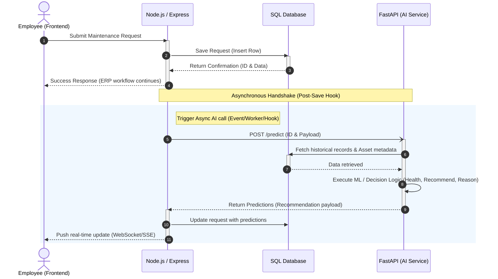
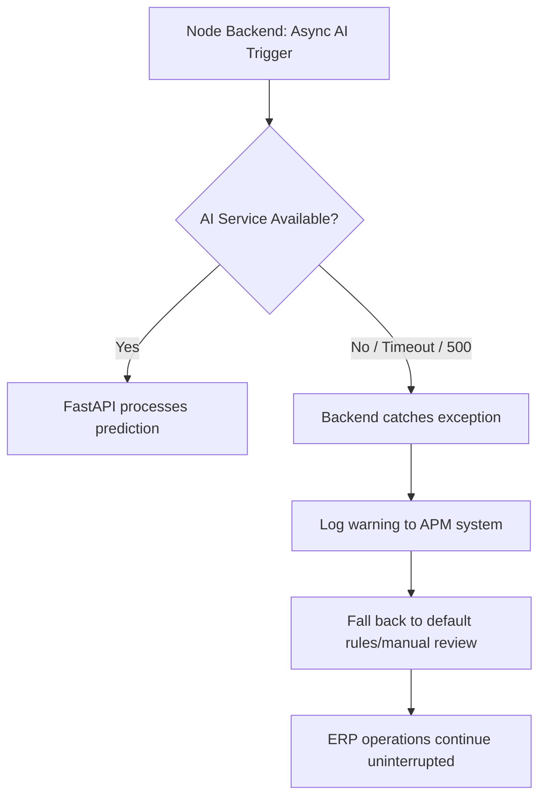

# AI Architecture: AssetFlow Integration

This document outlines the architectural design, integration patterns, communication flows, and failure modes for the **AssetFlow AI Module**.

---

## High Level Architecture

The AI module is designed as an asynchronous, non-blocking service enhancement. The following diagram illustrates the complete request-to-prediction lifecycle:

---

## Component Architecture

The system is separated into four components, each having strict boundaries of concern:

### 1. Frontend (Web/Mobile)
*   **Role:** Client-side interface for interaction.
*   **Responsibilities:**
    *   Captures maintenance requests input from employees.
    *   Performs initial form input validation.
    *   Submits requests to the Node.js backend.
    *   Listens for real-time prediction updates (via WebSockets or polling) to refresh UI components (specifically displaying the Repair/Retire recommendation, Asset Health Score, and the accompanying reason).

### 2. Backend (Node.js + Express)
*   **Role:** Core business logic and transaction coordinator.
*   **Responsibilities:**
    *   Handles authentication, authorization, and route-handling.
    *   Saves the initial maintenance request directly to the database.
    *   Triggers the asynchronous AI invocation *after* database transactions commit.
    *   Exposes endpoints for the FastAPI service to retrieve context or write predictions back.
    *   Pushes updated recommendations to the Frontend.

### 3. Database (PostgreSQL / MySQL)
*   **Role:** Single source of truth.
*   **Responsibilities:**
    *   Persists core maintenance requests, asset registries, logs, and user roles.
    *   Reuses standard tables for predictions by storing AI outputs in standard fields (e.g., updating standard nullable prediction attributes like health score and recommendations).
    *   Enforces relational integrity.

### 4. AI Service (Python + FastAPI)
*   **Role:** High-performance inference engine.
*   **Responsibilities:**
    *   Exposes REST endpoints specifically designed for predictive analysis.
    *   Queries historical database records and equipment parameters for context-aware model input.
    *   Runs simple ML and rule-based decision logic on Asset Age, Condition, Maintenance History, and Repair Frequency.
    *   Returns structured predictive JSON payloads back to the Node.js backend.

---

## Communication Flow

### Request Flow
1.  **Submission:** The client initiates a `POST /api/maintenance-requests` request to the Node.js server containing form data.
2.  **Persistence:** The Node.js application inserts a record into the SQL database.
3.  **Client Return:** Once saved, the Node.js server returns an immediate HTTP `201 Created` status with the request metadata, freeing the client.
4.  **Asynchronous Call:** An internal event emitter or worker queue triggers a non-blocking `POST /predict` HTTP call to the Python FastAPI server.

### Response Flow
1.  **AI Query:** FastAPI receives the request and fetches historical records for that specific asset type from the database.
2.  **Inference:** FastAPI feeds inputs to the decision logic pipeline.
3.  **Callout Response:** FastAPI returns predictions (`recommendation`, `asset_health`, `reason`) to the Node.js callback url.
4.  **Database Update:** The Node.js application writes these predictions into the database for the corresponding maintenance request ID.
5.  **State Synchronisation:** The Node.js backend notifies the client of updated attributes via WebSockets or Server-Sent Events (SSE).

---

## Failure Flow

A key architectural constraint is that the ERP must not depend on the AI's availability.

*   **Error Isolation:** The HTTP call from the Node.js server to FastAPI is wrapped in a `try-catch` block and executed inside a background job processor or `setImmediate` wrapper.
*   **Network Timeout Enforcement:** The connection to the FastAPI endpoint is configured with a strict timeout limit ($< 2.0\text{ seconds}$).
*   **ERP Continuity:** If the AI service is offline, returns a 500 error, or times out, the error is caught, logged, and the request reverts to standard manual triage. The end-user is completely unaware of the AI downtime.

---

## Why Microservice?

Separating the Python FastAPI service from the Node.js backend provides critical engineering benefits:

1.  **Language Suitability:** Node.js is optimized for I/O-bound operations and web APIs due to its asynchronous event-loop. Python, however, has a rich ecosystem of optimized machine learning and statistical tools (`numpy`, `pandas`) and performs better for CPU-bound numerical tasks like model inference and decision rules.
2.  **Compute & Scaling Isolation:** ML logic and calculation are CPU-intensive. Separating them ensures that a sudden spike in maintenance requests does not spike Node.js CPU usage or slow down core transaction throughput (e.g., authentication, booking).
3.  **Deployment Independence:** AI services, models, and dependencies change at a different cadence than web business logic. FastAPI can be re-deployed or scaled horizontally without restarting or redeploying the main Node.js ERP backend.

---

## Security Considerations

### Input Validation
*   The Node.js backend sanitizes and validates all payloads before passing parameters to FastAPI.
*   FastAPI utilizes `Pydantic` schemas to strictly validate inputs before passing them to the inference pipeline, preventing script injection or malformed data crashes.

### Internal API Protection
*   The FastAPI endpoints are not exposed to the public internet. They run on a private virtual network (VPC) accessible only by the Node.js backend.
*   Requests between Node.js and FastAPI are authenticated using pre-shared API keys (transmitted via HTTP headers) or mutual TLS.

### Timeout Thresholds
*   Strict connect and read timeouts (e.g., 2000ms) are enforced on the Node.js HTTP client making requests to FastAPI.
*   This prevents slow inference requests from exhausting socket pools on the Node.js gateway.
