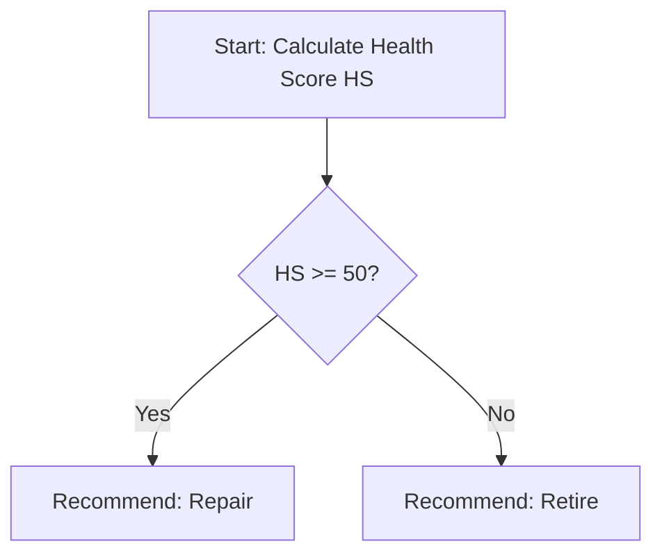

# AI Decision Logic: Repair vs. Retire Analysis

This document describes the logical architecture and mathematical models used by the AI module to evaluate asset health, determine whether to recommend repair or retirement, and automatically generate explanatory reasoning.

---

## 1. Asset Health Score Formula

The **Asset Health Score ($HS$)** is a normalized numerical index ranging from `0` (Critical Failure / End of Life) to `100` (Excellent / Like New). It is computed as a weighted average of three primary indicators based on age, condition, and maintenance frequency:

$$HS = (w_{\text{cond}} \cdot S_{\text{cond}}) + (w_{\text{age}} \cdot S_{\text{age}}) + (w_{\text{freq}} \cdot S_{\text{freq}})$$

Where the weights are defined as:
*   $w_{\text{cond}} = 0.40$ (Current physical condition)
*   $w_{\text{age}} = 0.30$ (Chronological age compared to expectancy)
*   $w_{\text{freq}} = 0.30$ (Repair frequency and maintenance history)

---

### Component Score Calculation

#### A. Condition Score ($S_{\text{cond}}$)
Maps qualitative operator-reported condition ratings to a $0-100$ scale:
*   **Excellent (5):** $100$
*   **Good (4):** $80$
*   **Fair (3):** $60$
*   **Poor (2):** $30$
*   **Very Poor (1):** $0$

#### B. Age Score ($S_{\text{age}}$)
Compares the current asset age in months ($A$) to its expected useful life ($EUL$) for its specific category:

$$S_{\text{age}} = \max\left(0, 100 \times \left(1 - \frac{A}{EUL}\right)\right)$$

*   *Example:* If a conveyor belt has an $EUL$ of $60$ months and is currently $45$ months old:
    $$S_{\text{age}} = 100 \times \left(1 - \frac{45}{60}\right) = 25$$

#### C. Repair Frequency Score ($S_{\text{freq}}$)
Penalizes assets with frequent breakdowns. It measures the number of repairs ($R$) during the preceding $12\text{ months}$ against a threshold maximum tolerated failures ($M_{\text{max}}$) for that asset category:

$$S_{\text{freq}} = \max\left(0, 100 \times \left(1 - \frac{R}{M_{\text{max}}}\right)\right)$$

*   *Example:* If an asset has failed $3$ times in the last year, and the threshold $M_{\text{max}}$ is $4$:
    $$S_{\text{freq}} = 100 \times \left(1 - \frac{3}{4}\right) = 25$$

---

## 2. Decision Matrix: Repair vs. Retire

Using the calculated **Health Score ($HS$)**, the AI triggers a direct, simplified decision path.

### Decision Threshold Rules

| Health Score Range | Recommendation | Action |
| :--- | :--- | :--- |
| **$HS \ge 50$** | **Repair** | Proceed with standard maintenance. The asset maintains functional viability. |
| **$HS < 50$** | **Retire** | Recommend retirement. The asset is heavily degraded due to age, poor physical condition, or excessive failure frequency. |

---

## 3. Natural Reason Generation

To ensure transparency, the AI module generates human-readable explanations explaining *why* a specific decision was recommended. The logic dynamically constructs sentences based on the dominant penalizing factors.

### Reason Assembly Pipeline

1.  **Identify Primary Penalty:** Determine which of the three sub-scores ($S_{\text{cond}}$, $S_{\text{age}}$, $S_{\text{freq}}$) has degraded the most (i.e. is the furthest below its maximum value of 100).
2.  **Select Template:** Apply the corresponding template based on the final decision output.

### Logic Rules and Templates

#### Case A: Recommendation is Retire ($HS < 50$)

*   **Rule 1 (Age Dominated):** If $S_{\text{age}}$ is the lowest score.
    *   *Template:* `"Retirement recommended because the asset has completed [Age]% of its expected lifespan ([CurrentAge]/[EUL] months)."`
*   **Rule 2 (Frequency Dominated):** If $S_{\text{freq}}$ is the lowest score.
    *   *Template:* `"Retirement recommended due to excessive repair frequency, with [Failures] breakdowns in the last 12 months exceeding reliability limits."`
*   **Rule 3 (Condition Dominated):** If $S_{\text{cond}}$ is the lowest score.
    *   *Template:* `"Retirement recommended as the physical state of the asset is rated as Poor/Very Poor, making repairs ineffective."`

#### Case B: Recommendation is Repair ($HS \ge 50$)

*   **Rule 1 (Healthy Asset):** If $HS \ge 75$.
    *   *Template:* `"Repair recommended. The asset maintains a healthy baseline score of [HS]% with stable failure intervals."`
*   **Rule 2 (Moderate Degradation):** If $50 \le HS < 75$.
    *   *Template:* `"Repair recommended. The asset exhibits moderate wear (Health Score: [HS]%) but remains viable under normal maintenance."`
