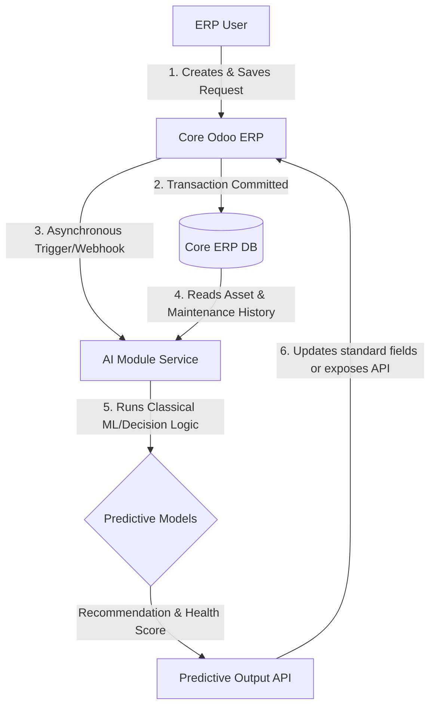

# AI Scope: AssetFlow Maintenance Enhancement

## 1. Project Objective
**AssetFlow** is an Enterprise Asset & Resource Management System designed for the Odoo Hackathon. The system aims to streamline authentication, asset management, asset allocation, resource booking, maintenance management, auditing, reporting, and notifications. The overarching goal is to maximize asset uptime and optimize resource utilization across the enterprise.

## 2. AI Module Objective
The **AssetFlow AI Module** acts as an intelligent, asynchronous enhancement to the core Maintenance Management module. Its objective is to leverage classical machine learning and statistical analysis to evaluate asset health and recommend whether an asset should be repaired or retired, without interrupting core ERP operations, requiring database schema modifications, or utilizing generative AI / Large Language Models (LLMs).

## 3. Scope
The AI module operates strictly as a post-save hook on maintenance requests. It intercepts newly saved maintenance requests, processes them using lightweight, offline algorithms, and outputs predictive metadata back to the ERP system or exposes it via a queryable microservice API.

## 4. Responsibilities
*   **Asynchronous Inference:** Executing machine learning / decision logic predictions only *after* a maintenance request has been successfully committed to the database.
*   **Asset Health Summary:** Generating a normalized health score for the asset based on age, condition, and maintenance history.
*   **Repair / Retire Recommendation:** Classifying whether the asset should be repaired or retired.
*   **Reason for Recommendation:** Providing a clear, human-readable reason string justifying the recommendation.
*   **Independent API Hosting:** Exposing prediction endpoints that the ERP can call to fetch or apply recommendations.
*   **Graceful Degraded State:** Ensuring that if the AI module is offline or fails, the core ERP maintenance workflow continues unimpeded.

## 5. Non-Responsibilities
*   **No Authentication/Authorization:** The AI module will not handle user login, tokens, or access control.
*   **No Core Asset CRUD Operations:** The AI module will not create, modify, or delete assets or core business tables.
*   **No User Interface (UI):** The AI module does not render frontend views; it interacts purely via APIs, webhooks, or database reads.
*   **No Chatbot/Conversational Interface:** There is no conversational or interactive natural language interface.
*   **No Scheduling/Booking Logic:** The module does not assign technicians or book calendar slots for resource allocation.
*   **No Notifications/Reporting:** The module will not generate PDF reports or send emails/alerts to users.
*   **No Priority or Hours Prediction:** The AI module does not forecast repair times, cost predictions, or priority classifications.

## 6. Constraints
*   **Zero Database Schema Modifications:** The AI module must reuse the existing database schema of Odoo's Maintenance and Asset modules. It cannot add new tables, columns, or views to the database.
*   **No LLMs or Generative AI:** Strict prohibition of OpenAI, Gemini, LangChain, vector databases, or Retrieval-Augmented Generation (RAG). All logic must use traditional ML or statistical rules.
*   **Asynchronous Execution:** The AI module must run strictly out-of-band. Core transactions must not block waiting for AI execution.
*   **Independent Deployability:** The AI module must be deployable as an independent service (e.g., a lightweight Python microservice using FastAPI) distinct from the main web application bundle.
*   **Network Isolation Resilience:** If the AI service fails or times out, the ERP must fall back to default business rules without throwing errors to the user.

## 7. Assumptions
*   **Sufficient Data Density:** The core ERP contains a representative history of maintenance requests and asset states to train or pre-load baseline statistical models.
*   **Webhook / Event Infrastructure:** The Odoo ERP provides an event hook (e.g., an Odoo `api.model` override on `create`/`write` methods) to trigger an outbound webhook or queue an asynchronous job.
*   **Read Access:** The AI module has read access to the relevant Odoo PostgreSQL tables (`maintenance.equipment`, `maintenance.request`, etc.) or reads them via standard Odoo XML-RPC/JSON-RPC APIs.

## 8. Dependencies
*   **Upstream ERP State:** Successful execution of the AI module depends on the maintenance request being successfully saved and assigned an ID by the database.
*   **Python Stack:** Standard libraries for classical machine learning and data processing (e.g., `scikit-learn`, `numpy`, `pandas`).
*   **Core ERP API:** Availability of the Odoo XML-RPC or REST API for pulling training data and pushing predictions.

## 9. Inputs
The AI module will read the following fields from the newly saved maintenance request and associated asset:
*   **Asset Age:** Cumulative chronological age of the asset.
*   **Asset Condition:** Operator-reported physical status or rating.
*   **Maintenance History:** Record of previous repairs and maintenance actions.
*   **Repair Frequency:** Rate of breakdowns or failures over time.

## 10. Outputs
The AI module generates predictions and returns them to the ERP system or exposes them via REST:
*   `recommendation`: A string indicating either `"Repair"` or `"Retire"`.
*   `asset_health`: An integer score between `0` and `100` summarizing the asset's current health.
*   `reason`: A string explaining the rationale behind the recommendation.

## 11. Success Criteria
*   **Zero Interference:** Core maintenance creation time is unaffected by AI execution (latency of core save operation remains $< 100\text{ms}$).
*   **Fault Tolerance:** 100% of maintenance requests are successfully saved even when the AI service is completely offline.
*   **Clean API Integration:** All output predictions are successfully bound to standard Odoo fields (e.g., updating the description, tags, or standard notes field) using standard Odoo API protocols.

## 12. Future Scope (Optional)
*   **Sensor Integration:** Utilizing IoT sensor telemetry (e.g., vibration, temperature) for real-time predictive maintenance triggering.

## 13. Out of Scope
*   Natural language processing (NLP) for complex user chat interactions.
*   Automated parts ordering or inventory reservation.
*   Optimization algorithms for technician routing and schedule dispatching.
*   Priority predictions, failure risk percentages, or maintenance duration estimations.
