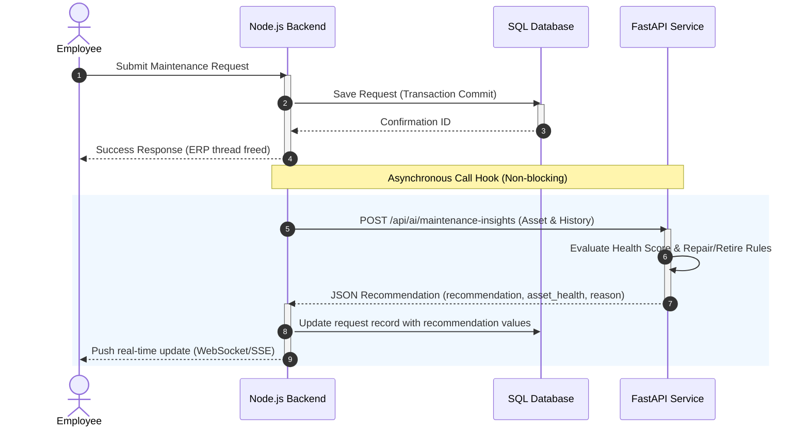

# AssetFlow AI Microservice

This microservice acts as the predictive analysis engine for the **AssetFlow Enterprise Asset & Resource Management System**. It is an independent FastAPI microservice built to perform offline diagnostic assessments (Repair vs. Retire) on industrial equipment based on physical condition, age, and maintenance frequency.

---

## Technical Stack
*   **Language:** Python 3.12+
*   **Framework:** FastAPI
*   **ASGI Server:** Uvicorn
*   **Data Validation:** Pydantic v2
*   **Settings Management:** Pydantic-settings

---

## Folder Structure

```text
ai/
├── app/                     # Core application source
│   ├── api/                 # Endpoint routing logic
│   │   ├── v1/              # API Version 1 routers
│   │   │   ├── endpoints/   # Endpoint controllers (health, insights)
│   │   │   │   ├── health.py
│   │   │   │   └── maintenance_insights.py
│   │   │   └── router.py    # Merged API routes
│   │   └── deps.py          # Dependency injection functions
│   ├── core/                # System settings, constants, and logger setup
│   │   ├── config.py        # Environment variables loader
│   │   ├── constants.py     # Centralized score thresholds and weights
│   │   ├── exceptions.py    # Global exception handler
│   │   └── logging_config.py# Unified logging layout
│   ├── models/              # Internal ML representations
│   ├── schemas/             # Request/Response schemas
│   │   ├── asset.py         # Asset validation schema
│   │   ├── maintenance.py   # Maintenance history log schema
│   │   ├── request.py       # API Request schema
│   │   ├── response.py      # API Response schema
│   │   └── error.py         # Standard Error schema
│   ├── services/            # Calculation and inference rules
│   │   ├── maintenance_service.py # Core insights evaluation service
│   │   └── rule_engine.py   # Decision scoring rule engine
│   ├── utils/               # Common helper utilities
│   └── main.py              # Application entrypoint
├── tests/                   # Pytest test suite
│   ├── conftest.py          # Shared test fixtures
│   ├── test_endpoints.py    # API endpoints validation tests
│   ├── test_health.py       # Health check test
│   ├── test_rule_engine.py  # Rule engine scoring tests
│   └── test_schemas.py      # Schema verification tests
├── docs/                    # Architecture diagrams and specifications
├── .env.example             # Configuration settings template
├── .env                     # Local settings instance (git-ignored)
├── README.md                # Deployment and developer manual
└── requirements.txt         # Package requirements manifest
```

---

## Environment Variables Configuration

The application loads settings from the environment or a `.env` file in the root directory.

| Variable Name | Type | Default Value | Description |
| :--- | :--- | :--- | :--- |
| `APP_NAME` | String | `"AssetFlow AI Service"` | The name of the microservice. |
| `APP_VERSION` | String | `"1.0.0"` | Current deployable release version. |
| `HOST` | String | `"127.0.0.1"` | Network interface to bind the server. |
| `PORT` | Integer | `8000` | Port on which the server listens. |
| `LOG_LEVEL` | String | `"info"` | System log level (`debug`, `info`, `warning`, `error`). |

---

## Installation & Setup Guide

Follow these steps to establish your local development virtual environment:

### 1. Create a Virtual Environment
In the root directory of the AI microservice, execute the virtual environment command:
```bash
python -m venv .venv
```

### 2. Activate the Virtual Environment
Activate the environment according to your operating system shell:
*   **Windows (PowerShell):**
    ```powershell
    .venv\Scripts\Activate.ps1
    ```
*   **Windows (Command Prompt):**
    ```cmd
    .venv\Scripts\activate.bat
    ```
*   **Linux / macOS (Bash/Zsh):**
    ```bash
    source .venv/bin/activate
    ```

### 3. Install Core Dependencies
Install the required application packages listed in the manifest file:
```bash
pip install --upgrade pip
pip install -r requirements.txt --trusted-host pypi.org --trusted-host files.pythonhosted.org --trusted-host pypi.python.org
```

---

## Running the Application

Ensure the virtual environment is active, then launch the Uvicorn ASGI server with hot-reload enabled:

```bash
uvicorn app.main:app --reload --host 127.0.0.1 --port 8000
```

---

## Core API Endpoints

### 1. Health Status
*   **Endpoint:** `/health`
*   **Method:** `GET`
*   **Description:** Returns the current operational status of the service.
*   **Response Example:**
    ```json
    {
      "status": "healthy",
      "service": "AssetFlow AI Service",
      "version": "1.0.0"
    }
    ```

### 2. Maintenance Insights
*   **Endpoint:** `/api/ai/maintenance-insights` (also available at `/api/v1/ai/maintenance-insights`)
*   **Method:** `POST`
*   **Description:** Evaluates asset metrics and returns a Repair vs. Retire recommendation with an asset health score.
*   **Request Payload Example:**
    ```json
    {
      "asset": {
        "id": 42,
        "asset_tag": "AST-HVAC-001",
        "name": "Server Room AC Unit",
        "category": "HVAC",
        "age": 36,
        "condition": "Fair"
      },
      "maintenance_history": [
        {
          "date": "2026-05-15",
          "issue": "Replaced standard compressor filter",
          "status": "Resolved"
        }
      ]
    }
    ```
*   **Response Payload Example:**
    ```json
    {
      "recommendation": "REPAIR",
      "asset_health": 72,
      "reason": "Repair recommended. The asset exhibits wear (condition: 'Fair') but remains viable under normal maintenance."
    }
    ```

---

## API Documentation Links

When the application is running, the Swagger interactive UI is accessible locally:

*   **Interactive Swagger UI:** [http://127.0.0.1:8000/docs](http://127.0.0.1:8000/docs)
*   **Static ReDoc UI:** [http://127.0.0.1:8000/redoc](http://127.0.0.1:8000/redoc)

---

## Running the Test Suite

To run the unit and integration tests, run the following command in the virtual environment:

```bash
pytest
```

---

## AI Integration Workflow Diagram

The sequence diagram illustrates how the AI service integrates with the core ERP Node.js backend.



---

## Integration Notes for the Backend Team

To integrate the AI Module successfully with the Node.js/Express backend, please follow these guidelines:

1.  **Asynchronous Call Hook:** 
    Trigger the call to the AI service **only after** the maintenance request has been successfully committed to the database. Wrap the HTTP request using a background worker (e.g. queue, event emitter, or `setImmediate`) to keep it out of the main request-response pipeline.
2.  **Strict Timeout Settings:**
    Enforce a request timeout limit of **2000ms** on your HTTP client when calling the `/api/ai/maintenance-insights` endpoint.
3.  **Graceful Fallback:**
    If the AI service is offline, returns a `500` error, or times out, catch the exception, write a warning log, and allow the ERP workflow to continue unimpeded. The AI recommendations are supplementary insights and are optional. Do not disrupt the operator's experience.